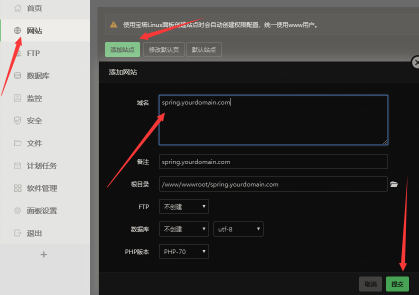

### 项目简介

Wanna Spring是一个记录个人信息，采用前后端分离的项目。
项目的初衷是我想在这个信息时代，能记录下自己的每一天，也是一个学习前后端分离的实践项目，供大家参考、学习、讨论，小白一枚，写的不好的地方还请多多指教。

### 技术选型

- LomBok 插件

- Spring Boot + Spring + Spring MVC + Spring Data MongoDB + Swagger

- Redis + MongoDB

- Vue + JQuery + Bootstrap + Element UI + Axios + DayJS + Validator + JSCookie + VCharts

### 主要功能

- 收益信息，包括日常的收入和支出

- 日程信息，就是我们什么时候做了什么事

- 代办事项，记录下我们明天或后天或将来要做的事情

- 其他功能还未想好。。。。。。

### 运行项目

- 后端

    运行主类 [SpringBeeApplication](spring-bee/src/main/java/org/code4everything/springbee/SpringBeeApplication.java) 即可
    
- 前端

    ``` shell
    cd /path/wanna-spring/spring-fee
    npm run dev
    ```
    
    > 第一次运行可能报错，安装需要的依赖包即可

### 部署项目

1. **安装宝塔管理工具**

    - 安装宝塔请移步 [https://www.bt.cn/bbs/thread-19376-1-1.html](https://www.bt.cn/bbs/thread-19376-1-1.html)
    
    - 安装成功之后，进入宝塔管理界面，进入软件管理，然后安装 `Nginx`、`Redis`、`MongoDB`

2. **部署后端服务**

    1. 修改必要的配置

        - 修改 [application.properties](spring-bee/src/main/resources/application.properties) 文件
            
            ``` properties
            # 去掉注释
            spring.profiles.active=prod
            ```  
        - 修改 [application-prod.properties](spring-bee/src/main/resources/application-prod.properties) 文件
        
             ``` properties
             # 下面的信息必须使用自己的，如果示例的邮箱发送邮件过于频繁，将会导致邮件服务被关闭
             # 如何开通邮箱的第三方登录，请自行百度谷歌
             spring.mail.host=mail server host
             spring.mail.protocol=mail server protocol
             spring.mail.username=mail username
             spring.mail.password=mail password or key
             ```    
        - 根据实际情况修改 [config.json](spring-bee/config.json) 文件
        
    2. 打包部署

        ``` shell
        # 进入后端项目目录
        cd /path/wanna-spring/spring-bee
        # 打包
        mvn package -Dmaven.test.skip=true
        # 上传 targe 目录下面的 spring-bee-x.x.x.jar 文件至服务器（建议新建文件夹）
        ```
        
        > 同时将 [config.json](spring-bee/config.json) 上传至同级目录
        
    3. 升级成HTTPS

3. **部署前端服务**
    
    1. 修改 [api.js](spring-fee/src/api/api.js) 文件
    
        ``` javascript
        // 修改成自己的主机
        const host = 'https://spring-api.yourdomain.com'
        // 注释掉URL打印
        // console.info(`request url -> ${config.url}`)
        ```
    2. 打包
    
        ``` shell
        # 进入前端项目目录
        cd /path/wanna-spring/spring-fee
        # 打包
        npm run build
        ```
        > 第一次打包可能报错，原因是依赖包未安装，安装依赖包重新打包即可。
        
    3. 用宝塔创建网站
    
        
        
        然后压缩 `dist` 目录下的 [index.html & static](spring-fee/dist) 文件，并上传至网站根目录，解压即可
        
    4. 升级成HTTPS
    
### 写在最后

欢迎大家一起来交流学习，反馈BUG或建议什么的，本人QQ735817834，有兴趣的小伙伴欢迎贡献代码哦，觉得不错的请点个赞支持一下吧。
喝碗鸡汤，永远相信明天更美好，哈哈！
