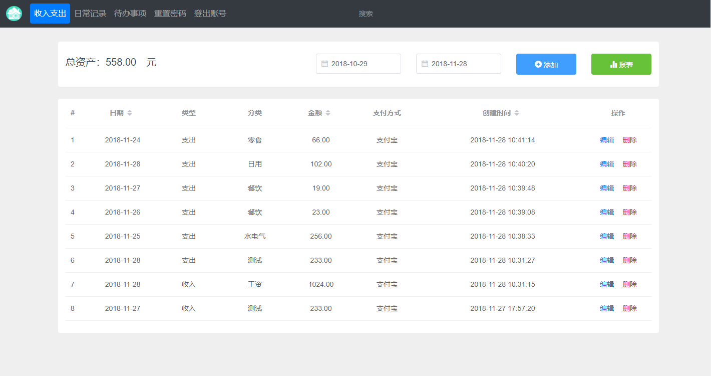
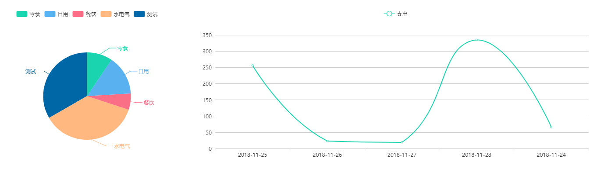
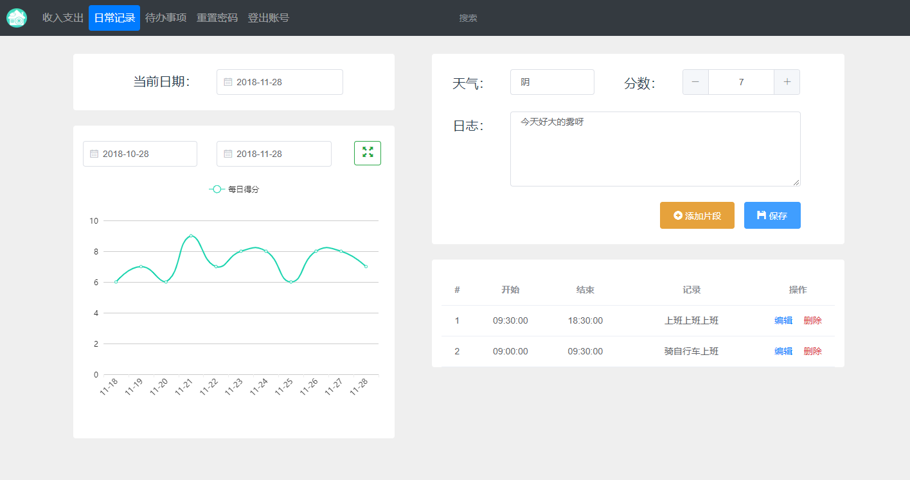
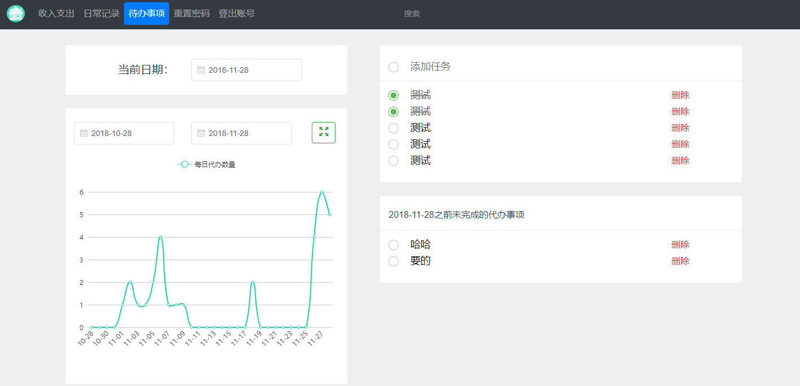
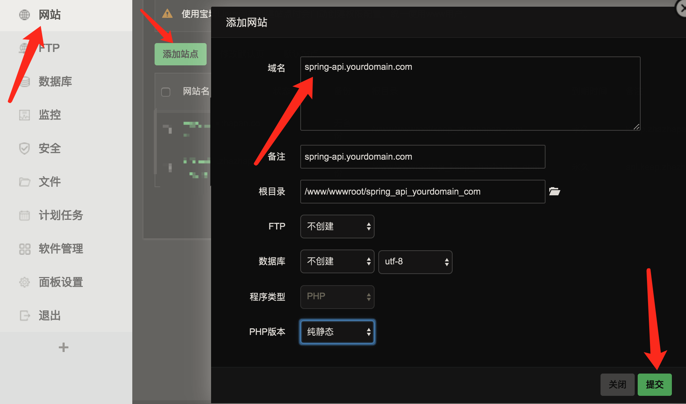
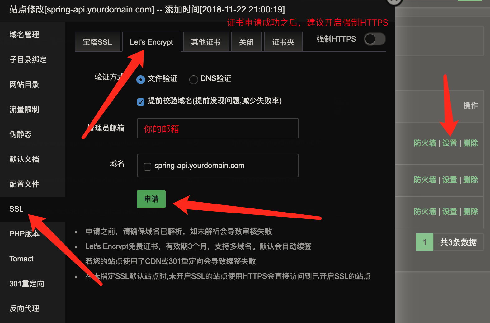
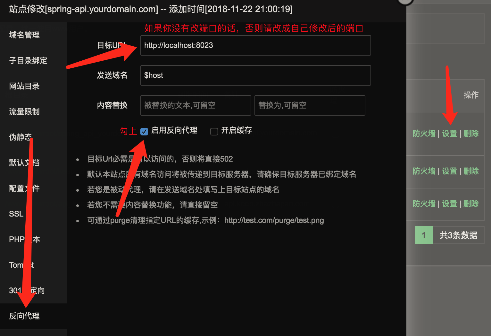
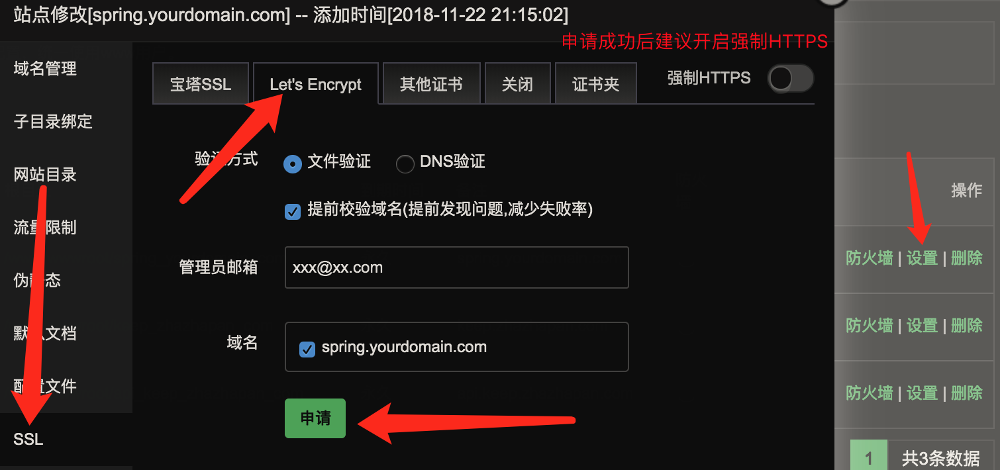

## 项目简介

Wanna Spring是一个记录个人信息，采用前后端分离的项目。
项目的初衷是我想在这个信息时代，能记录下自己的每一天，也是一个学习前后端分离的实践项目，供大家参考、学习、讨论，小白一枚，写的不好的地方还请多多指教。

> 对于一个后端同学来说写前端着实太吃力了 :joy:

## 开发环境

1. JDK 1.8

2. Redis 4.0.11

3. MongoDB 4.0.0

4. IntelliJ IDEA 2018.2.6

5. Maven 3.5

6. Lombok Plugin

7. Node 10.10.0

8. Vue 2.9.6

9. Spring Boot 2.0.4.RELEASE

## 技术选型

- Spring Boot + Spring + Spring MVC + Spring Data MongoDB + Swagger

- Redis + MongoDB

- Vue + JQuery + Bootstrap + Element UI + Axios + DayJS + Validator + JSCookie + VCharts

## 主要功能

- 收益信息，包括日常的收入和支出

- 日程信息，就是我们什么时候做了什么事

- 代办事项，记录下我们明天或后天或将来要做的事情

- 其他功能还未想好。。。。。。

## 运行项目

- 后端

    运行主类 [SpringBeeApplication](spring-bee/src/main/java/org/code4everything/springbee/SpringBeeApplication.java) 即可

- 前端

    ``` shell
    cd /path/wanna-spring/spring-fee
    # 安装依赖
    npm install
    # 运行项目
    npm run dev
    ```

## 运行截图

收益记录



支出报表



日程记录



代办事项



## 部署项目

#### 安装宝塔管理工具（推荐）

- 安装宝塔请移步 [https://www.bt.cn/bbs/thread-19376-1-1.html](https://www.bt.cn/bbs/thread-19376-1-1.html)

- 安装成功之后，进入宝塔管理界面，进入软件管理，然后安装 `Nginx`、`Redis`、`MongoDB`

#### 部署后端服务

1. 修改必要的配置

    - 修改 [application.properties](spring-bee/src/main/resources/application.properties) 文件

        ``` properties
        # 去掉注释
        spring.profiles.active=prod
        ```

    - 修改 [application-prod.properties](spring-bee/src/main/resources/application-prod.properties) 文件

        ``` properties
        # 下面的信息必须使用自己的，如果示例的邮箱发送邮件过于频繁，将会导致示例邮箱的邮件服务被关闭
        # 如何开通邮箱的第三方登录，请自行谷歌百度
        spring.mail.host=mail server host
        spring.mail.protocol=mail server protocol
        spring.mail.username=mail username
        spring.mail.password=mail password or key
        ```

    - 根据实际情况修改 [config.json](spring-bee/config.json) 文件

2. 打包部署

    ``` shell
    # 进入后端项目目录
    cd /path/wanna-spring/spring-bee
    # 打包
    mvn package -Dmaven.test.skip=true
    ```

    >  打包后上传 target 目录下面的 spring-bee-x.x.x.jar 文件至服务器（建议新建一个文件夹），同时将 [config.json](spring-bee/config.json) 上传至同级目录

3. 运行

    ``` shell
    # 运行，防止BASH窗口关闭时进程挂掉
    setsid java -jar spring-bee.x.x.x.jar &
    # 关闭进程
    lsof -i:8023 # 查找运行的端口，会看到运行在此端口的进程的PID
    kill -9 PID # 强制关闭进程
    ```

4. 升级HTTPS

   使用宝塔工具，创建一个站点

   

   申请证书，开通HTTPS

   

   设置反向代理

   

#### 部署前端服务

1. 修改 [api.js](spring-fee/src/api/api.js) 文件

    ``` javascript
    // 修改成自己的主机
    const host = 'https://spring-api.yourdomain.com'
    ```

2. 打包

    ``` shell
    # 进入前端项目目录
    cd /path/wanna-spring/spring-fee
    # 安装依赖
    npm install
    # 打包
    npm run build
    ```

3. 用宝塔创建网站

   

   然后压缩 `dist` 目录下的 [index.html & static](spring-fee/dist) 文件，并上传至网站根目录，解压即可

4. 升级HTTPS

   

## 写在最后

欢迎大家一起来交流学习，反馈BUG或建议什么的，本人QQ735817834。有兴趣的小伙伴欢迎加入贡献代码哦，觉得不错的点个Star支持一下呗。
最后，喝碗鸡汤，永远相信明天更美好，哈哈 :grimacing:
